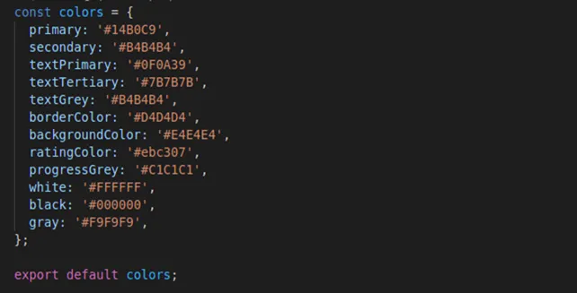

# theme/

- **fonts** - It contains global fonts like font size, font type, and font-weight. Whenever you come across situations where
  you need to use the same size of fonts and the same font family, you have to create a theme/font.

Here’s what the `/theme/fonts.js` looks like:

- **colors** - All the colors your application using goes here. All the repeating colors, for example, your application has
  theme colors which are black & red so you can add primary & secondary colors like black & red. Sample code you can see
  below image.

Here’s what the `/theme/colors.js` looks like:

- **metrices** - This will hold your device dimensions so you can export and use them for responsive layouts. It will manage
  all the fonts, margins, and images according to device size.

Here’s what the `/theme/metrics.js` looks like:

